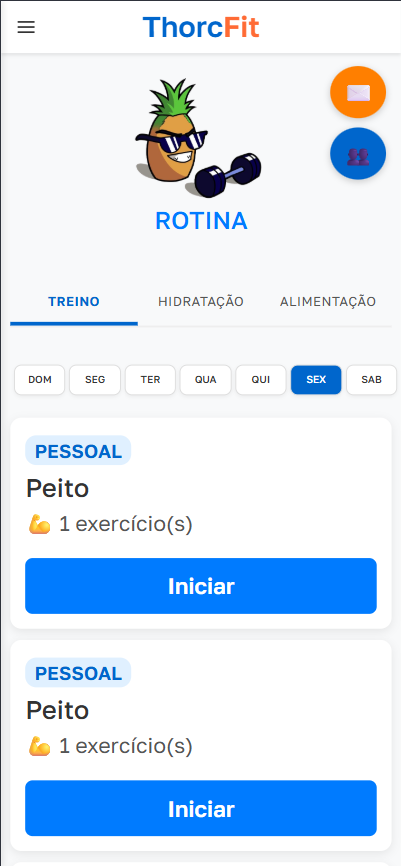
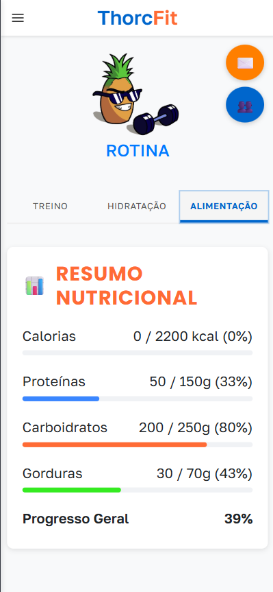
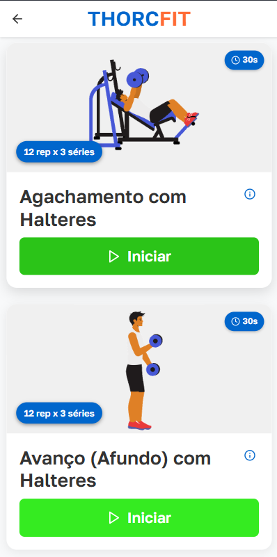
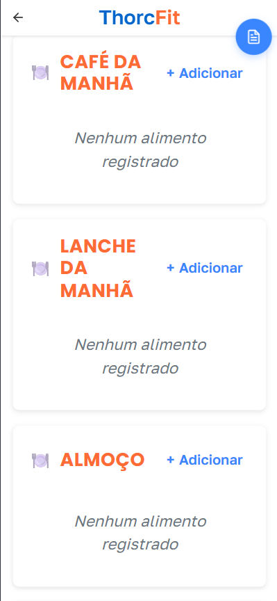
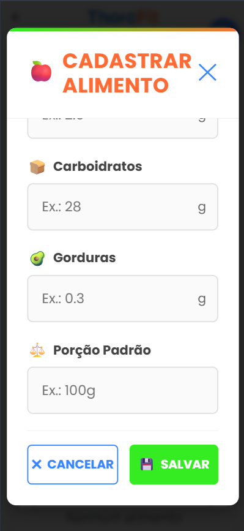

# 🏋️‍♂️ THORCFIT — Plataforma de Gestão de Treinos e Nutrição

## 📑 Sumário
- [Sobre](#-sobre)
- [Tecnologias Utilizadas](#-tecnologias-utilizadas)
- [Funcionalidades Principais](#-funcionalidades-principais)
- [Estrutura do Projeto](#-estrutura-do-projeto)
- [Instalação e Execução](#%EF%B8%8F-como-instalar-e-rodar)
- [Credenciais de Teste](#-credenciais-de-teste)
- [Prints da Tela](#-prints-da-tela)
- [Colaboradores](#-colaboradores)

---

## 📌 Sobre

**About**  
Este repositório é um **fork** do projeto desenvolvido em parceria com **Gabriel Paulino** para o **Trabalho de Conclusão de Curso da FATEC Campinas** no curso de **Análise e Desenvolvimento de Sistemas** — participei ativamente no desenvolvimento do **frontend** e nas demais partes da documentação.

📄 **Documentação completa do projeto**: [Acesse no Notion](https://grandiose-latency-d0d.notion.site/THORCFIT-TG-II-20ee392f4691809b94b7c78b94e2cbdb?pvs=73)

O **THORCFIT** é uma aplicação web para **gerenciamento de treinos e planos nutricionais**, criada para:

- **Treinadores e nutricionistas** que desejam planejar, acompanhar e orientar alunos/pacientes.
- **Iniciantes na academia** que querem seguir planos prontos ou criar seus próprios treinos e dietas.

A plataforma possibilita:
- 📋 **Cadastro de usuários, treinos e refeições**
- 📆 **Planejamento personalizado**
- 📊 **Relatórios de evolução**
- 🔗 **Interação entre profissionais e alunos**
- 🏠 **Acesso online via navegador**

---

## 🖼 Prints da Tela
| Tela de Home| Dashboard | Treinos | Alimentos | Cadastrar Alimentos |
|---------------|-----------|--------------------|-----------| ------------ |
|  |  |  |  | 


## 🛠 Tecnologias Utilizadas

| Área        | Tecnologias                                                                 |
|-------------|-----------------------------------------------------------------------------|
| **Frontend** |  HTML5 •  CSS3 •  JavaScript •  React |
| **Backend**  |  Node.js •  Express |
| **Database** |  MySQL |
| **Outros**   |  Git •  Linux | 

---

## 🚀 Funcionalidades Principais

✅ Cadastro de usuários (profissionais e alunos)  
✅ Criação e edição de treinos e dietas  
✅ Acompanhamento de progresso com relatórios  
✅ Interface responsiva e intuitiva  
✅ Conexão entre treinadores/nutricionistas e alunos  

---

## 📂 Estrutura do Projeto

THORCFIT/

│

├── thorcfit_backend/ # Código do servidor (Node.js)

├── raiz/frontend/ # Código do cliente (React)

├── thorcfit.sql # Script do banco de dados MySQL

└── documentacao/ # Diagramas e documentos técnicos (diagramas no Notion)

## ⚙️ Como instalar e rodar

### Pré-requisitos
- Node.js (>= 14)
- npm
- MySQL Server (>= 8.0)

## 1. Clonar o repositório
```bash
git clone https://github.com/DioCrM22/ThorcFit
cd ThorcFit
 ```

## ⚙️ Instalação e Configuração

### Pré-requisitos
- Node.js (>= 14)
- npm
- MySQL Server (>= 8.0)

---

## 1. Clonar o repositório
```bash
git clone https://github.com/DioCrM22/ThorcFit
cd ThorcFit
 ```

## 2. Configurar o banco de dados
```bash
sudo mysql -u root -e "CREATE DATABASE IF NOT EXISTS thorcfit;"
sudo mysql -u root thorcfit < thorcfit.sql
 ```

### Se houver problemas com acesso root sem senha:

```bash
sudo mysql -u root -e "ALTER USER 'root'@'localhost' IDENTIFIED WITH mysql_native_password BY ''; FLUSH PRIVILEGES;"
 ```

## 3. Iniciar o Backend
```bash
cd thorcfit_backend
npm install
```
### Crie o arquivo .env na pasta do backend com:

### .env
```bash
DB_NAME=thorcfit
DB_USER=root
DB_PASSWORD=
DB_HOST=localhost
DB_PORT=3306
```
### Inicie o servidor:
 

```bash
npm start
 ```

### O backend estará disponível em: http://localhost:3001

## 4. Iniciar o Frontend
```bash
cd ../raiz/frontend
npm install
npm start
```

### O frontend estará disponível em: http://localhost:3000
 
## 🔑 Credenciais de Teste
### makefile

Email: **diogo@teste.com**

Senha: **Abc123!@**

## 🤝 Colaboradores

<table>
  <tr>
    <td align="center">
      <a href="https://github.com/DioCrM22">
        
        <br />
        <sub><b>Diogo Cruz Maia</b></sub>
      </a>
      <br />
      <span>Frontend & Documentação</span>
    </td>
    <td align="center">
      <a href="https://github.com/lipeszl">
        
        <br />
        <sub><b>Gabriel Paulino</b></sub>
      </a>
      <br />
      <span>Backend & Banco de Dados</span>
    </td>
  </tr>
</table>
